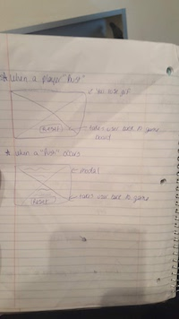

<<<<<<< HEAD
# blackJack
** Click to launch Project:**
** Click to view User Story**
=======
# Black Jack
**Click to Launch Project:**   

**Click to view User Story on Trello:** <https://trello.com/b/GEseWYCb/untitled-board>
>>>>>>> 0f14f3bd479ab05dfced81089f075853ff9141a1

# Project Objective
### The goal of Black Jack is score 21, however, there are other ways to win. The Players' main objective is to beat the dealer. This can be accomplished by trying to get their score equal 21 or get as close to 21 as possible without going over 21. 

# Technologies Used
* Programming Languages - Javascript, HTML, CSS, JQuery
* Visual Studio
* iTerm
* User Stories - Trello
* Sublime Text - to create README file
* Host & Deploy - BitBalloon

#Game Features
* AI Dealer
* Splash Page
* Game Instructions
* Scoring board
* Hit, Stand and Deal buttons

# Instructions

# Wire Frame

